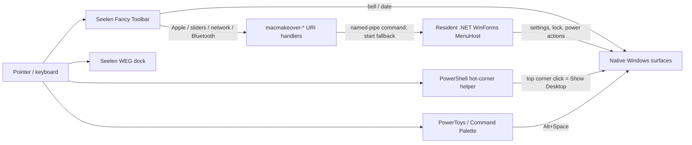

# Mac Makeover Recovery Audit Spec

Status: recovery baseline, bounded implementation, and post-change verification recorded on 2026-07-10 (Europe/London). Overall product acceptance remains partial because exact corner/bell/date and some toolbar-click tests are still open.

Baseline: `main` at `6819380`; the worktree was clean and matched `origin/main` before this audit began.

## Problem statement

`mac-makeover` has accumulated several generations of shell integration around Seelen UI, PowerToys, PowerShell helpers, protocol handlers, and a resident WinForms MenuHost. The current desktop is substantially functional, but prior fixes were accepted without a repeatable multi-state and multi-monitor evidence set. This makes regressions in Alt+Tab, popup ownership, work-area reservation, toolbar schema, and visual layout too easy to reintroduce.

The recovery goal is a fast, restrained, Mac-inspired Windows desktop whose custom surfaces never compromise native switching, lock-screen safety, app work areas, or diagnosability. Verification must distinguish static configuration guards from interactions that were actually exercised.

## User-facing success criteria

- Native Windows Alt+Tab remains available with no menu open and dismisses any MenuHost popup when switching begins.
- Seelen shortcuts and task-switcher behavior remain disabled.
- Apple, Control Center, Network, and Bluetooth actions open the intended surface without a visible terminal and without spawning duplicate MenuHost processes.
- Bell and date/time open the Windows notification/calendar surface and do not stack over a custom popup.
- The Apple and right-side controls remain item-owned; broad top-bar pixel zones remain disabled.
- Top toolbar and WEG dock survive normal operation and a Seelen restart on every active monitor.
- Maximized client content ends at each monitor's work area and is not covered by the dock.
- Desktop-visible and maximized-window states are both visually coherent.
- Top-bar text, icons, badges, and popup rows are vertically aligned, unclipped, and free of separator/tooltip artifacts.
- The dock remains opaque enough that content does not show through it.
- Warm popup launches feel immediate, repeated use keeps one MenuHost process, and no sustained CPU or memory growth is observed.
- `scripts/verify.ps1` produces evidence for each active monitor rather than ambiguous virtual-desktop edge crops.

## Explicit non-goals

- Replacing Explorer or implementing a complete macOS shell clone.
- Re-enabling Seelen shortcuts, Seelen task switcher, or `@seelen/tb-quick-settings`.
- Reintroducing a MenuHost dock, appbar reservation, background window mover, or Explorer restart loop.
- Changing Windows Security, lock-screen policy, remote-access credentials/configuration, or work-account state.
- Redesigning wallpaper, cursors, launcher providers, or the dock's application set during this recovery pass.
- Treating old QA images as current proof when the interaction was not rerun.

## Current architecture

Ownership boundaries:

- Seelen owns rendering and work-area integration for the top bar and bottom dock on both displays.
- MenuHost owns only Apple, Control Center, Network, and Bluetooth popups. It uses `WS_EX_NOACTIVATE`, `ShowWithoutActivation`, and an Alt/foreground dismissal timer.
- Protocol handlers use headless `conhost` launchers to write to the resident MenuHost pipe, with a self-healing `--show` fallback.
- Windows owns Alt+Tab, notification/calendar UI, settings, lock, sleep, restart, and shutdown.
- The hot-corner helper polls only for configured corner clicks and popup cleanup; all broad item routing is disabled in current configuration.

## Environment and baseline evidence

- Active displays: two. DPI-aware bounds are 1920x1200 primary and 1920x1080 secondary, with the secondary positioned above and left of the primary.
- Both displays expose a 29/19 px top work-area inset and an approximately 108/91 px bottom reservation in DPI-aware/non-DPI-aware coordinates respectively.
- Running core components: Seelen UI 2.7.4, `slu-service`, one `MacMakeover.MenuHost`, Windows PowerShell hot-corner helper, PowerToys, and Command Palette.
- RustDesk, Tailscale, and TeamViewer processes were observed but not inspected or changed.
- Repo and live copies match for Seelen settings, toolbar state, toolbar CSS, dock CSS, and the network plugin.
- `settings_shortcuts.json` differs only by trailing whitespace/newline and is semantically the required disabled JSON.
- Live WEG state has runtime drift: newer Claude/Codex paths and an unpinned Terminal item; the repo remains restore-oriented and contains version-specific absolute package paths.
- Baseline `scripts/verify.ps1 -CaptureScreenshot` passed and produced `qa/visual-qa-20260710-121233/`.

## Findings, ordered by severity

### High, resolved in this pass: MenuHost popups were hard-wired to the primary monitor

The baseline `MenuForm.OnHandleCreated` used `Screen.PrimaryScreen`. An actual Apple toolbar click on the secondary display opened the menu on the primary display. MenuHost now captures `Screen.FromPoint(Cursor.Position)` before handle creation and uses that screen for placement/DPI context. With the pointer on DISPLAY2, the rebuilt host logged DISPLAY2 and the Apple menu appeared at that display's upper-left edge in `qa/recovery-audit-20260710/postfix-secondary-apple-menu-open.png`. A final actual toolbar-click recheck is still desirable because the post-change proof used the resident pipe command.

### High, resolved in this pass: visual verification was not monitor-correct

The baseline FFmpeg capture was the full 2511x2280 virtual desktop, but `verify.ps1` created `top-130.png` from the virtual desktop's global top and `bottom-240.png` from its global bottom. The verifier now enables DPI-aware screen enumeration, captures the full virtual desktop in both FFmpeg and fallback paths, makes legacy top/bottom files exact copies of the primary-monitor crops, and emits full/top/bottom images for every display. Hash comparison confirmed the legacy files match the primary files.

### High: required interaction acceptance is not yet fully evidenced

The Apple click and Apple-to-Alt+Tab dismissal were exercised successfully. The Windows automation connection then failed to activate normal windows after a shell URI test, so physical corner clicks, Control-Center-to-Alt+Tab, and several real toolbar click paths remain open gates. Protocol and pipe tests do not count as substitutes for those exact clicks.

### Medium: notification/date routing has one implementation for two controls

Both the bell and date/time call `macmakeover-notification-center:`, which runs a headless PowerShell action that sends Win+N. This is compatible with Windows 11's combined notification/calendar surface, but it does not explicitly close MenuHost first. The protocol test did not produce durable screenshot evidence of the surface, so distinct bell/date behavior and no-stacking remain unproven.

### Medium: MenuHost can block its UI thread on external commands

Network and Bluetooth construction call `netsh` or Windows PowerShell synchronously. `RunHidden` calls `ReadToEnd()` before `WaitForExit(timeoutMs)`, so the stated timeout cannot protect against a process that never closes its redirected streams. Warm tests were acceptable (about 371 ms Network and 291 ms Bluetooth), but the failure mode can freeze all MenuHost panels.

### Medium-high: repeated Control Center churn retains resources

Repeated open-close cycles kept one responsive MenuHost PID, but resource use did not plateau. Twenty Apple-only cycles added about 9 MB and 15 handles after an eight-second settle; ten Control-only cycles then added about 3.5 MB and 68 handles after ten seconds. Earlier mixed batches also grew. The resident host was restarted after testing and returned to about 32 MB/231 handles. Control Center state enrichment/timers/process or COM lifetime should be profiled before this risk is accepted.

### Medium: live dock state and restore state drift

Seelen rewrote live WEG state with runtime package paths and a transient Terminal entry. Recent Seelen logs contain a missing Codex icon path error. Absolute versioned WindowsApps paths make restore snapshots fragile across app updates and machines.

### Low: documentation contains stale architecture claims

The handover still says some normal clicks are caught by the hot-corner top-bar router even though all broad click-zone booleans are disabled and the toolbar owns the actions. It also contains old repository/remote statements. These contradictions increase recovery risk.

### Visual baseline

The two toolbars and docks are present, dock backgrounds are opaque, maximized content stops above the docks, top-bar text is compact and vertically centered, and no bottom hairline was visible. Apple, Control Center, Network, and Bluetooth panels are readable with consistent row alignment. The baseline did not establish a current minimized/show-desktop state.

## Architecture risk assessment

| Area | Evidence | Risk |
|---|---|---|
| Seelen toolbar/WEG ownership | Both monitors render; work areas are reserved; verifier guards performance modes and WEG enablement | Medium: schema and app-path drift remain external dependencies |
| MenuHost popup ownership | Fast warm launches, no activation, one process, Alt dismissal works for Apple | Medium-high: primary-monitor anchoring and synchronous probes |
| URI launch layer | Correct registry commands; no visible terminal in Apple test | Medium: duplicated installers and transient shell ownership |
| Hot-corner helper | Dwell and broad zones disabled; one Windows PowerShell instance | Medium: large dormant routing/fallback surface around a small active requirement |
| QA harness | Static guard coverage is strong | High until per-monitor captures and missing interactions are gated explicitly |

## Architecture decision: simplify current architecture

Keep the successful ownership model, but reduce and harden it rather than rebuilding:

1. Keep Seelen as the sole toolbar/dock owner and keep native Windows Alt+Tab/search/notification surfaces.
2. Keep one resident MenuHost for the four custom panels; make popup placement monitor-aware and move blocking state probes off the UI thread in a later bounded task.
3. Keep item-owned toolbar actions and delete dormant broad pixel-zone and WPF warm-runspace paths only after equivalent startup/recovery tests exist.
4. Consolidate protocol registration and notification/menu dismissal behavior in a later task instead of adding another helper.
5. Make per-monitor screenshot output and interaction gates first-class verification artifacts.

A rebuild is not justified: the baseline passes static guards, renders coherently on both monitors, preserves native switching in the exercised Apple path, and keeps one resident host. Keeping the architecture unchanged is also rejected because the observed secondary-monitor failure and unverifiable crop model are structural defects.

## Implementation and post-change result

- Changed `MenuHost` placement to capture the pointer's screen before handle creation; added a verifier regression guard against `Screen.PrimaryScreen`.
- Changed `verify.ps1` to produce DPI-aware virtual and per-monitor screenshot sets while preserving legacy primary crop names.
- Release build passed with zero warnings/errors after stopping the locked resident executable; the rebuilt host was restarted hidden.
- PowerShell parser check, `git diff --check`, `verify.ps1`, and `verify.ps1 -CaptureScreenshot` passed.
- Seelen was restarted through `\Seelen\Seelen UI Service`; both Fancy Toolbar and WEG instances reported Ready on both displays, and post-restart verification passed.
- `fit-windows-to-workarea.ps1 -WhatIf` returned no repair candidates.
- Final inspected screenshot set: `qa/visual-qa-20260710-123039/`, including both displays' full/top/bottom files.
- Both docks remained opaque and below maximized client content; both menu bars remained aligned with no hairline or clipping regression.
- Product acceptance is not complete: Control-to-Alt+Tab, physical corner clicks, bell/date behavior, minimized desktop, and a user-observed lock/PIN check remain open. Notification protocol execution did not yield a durable notification/calendar screenshot.

## Recovery-pass scope and stop gates

This pass may change only:

- `tools/MacMakeover.MenuHost/Program.cs` for monitor-aware popup placement.
- `scripts/verify.ps1` for DPI-aware virtual-desktop and per-monitor crops.
- The four recovery documents.

Stop and roll back a runtime change if any of the following occurs: MenuHost activates or enters Alt+Tab; a panel fails to paint; Seelen bars/docks disappear; work-area bounds change; a new MenuHost process remains; parser/build/static verification fails; or post-change screenshots are worse than the baseline.
